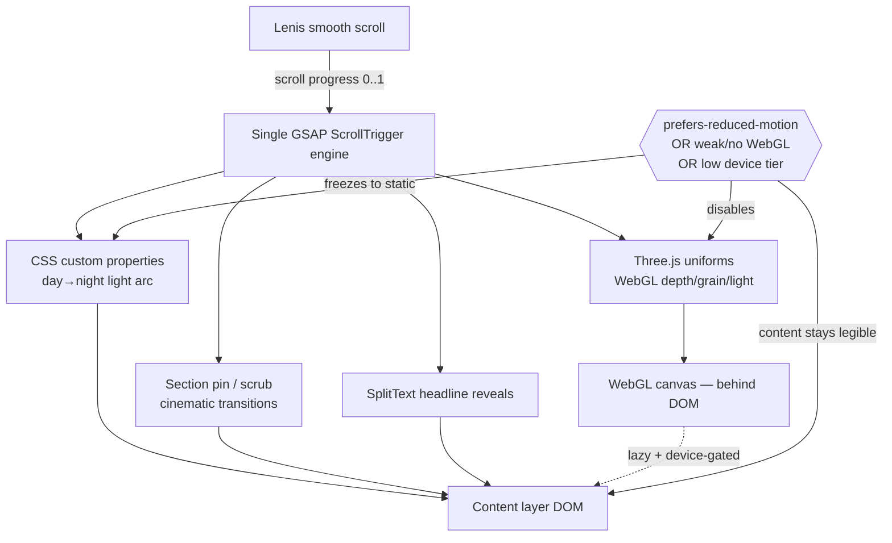

# feat: Cinematic scroll-film redesign (day→night light arc)

## Summary

Migrate the static Blue Line site to a Vite build, then layer a scroll-driven cinematic system on top: Lenis smooth scroll + GSAP/ScrollTrigger choreography + a Three.js WebGL depth layer, all driven by one engine — a **day→night light arc** keyed to scroll progress. Delivered in four phases, each shipping a working, better site, with reduced-motion and mobile fallbacks baked into every layer.

---

## Problem Frame

The site is a polished editorial piece with motion bolted on, not choreographed — it reads "tasteful advisor site," not "unforgettable." The redesign turns the existing real assets (reels, photography, the animated moonrise) into a continuous cinematic experience built on an ownable concept. Full situational framing lives in the origin doc (see Sources & References). This plan addresses *how* to build that without losing the fiduciary trust that is the practice's differentiator, and without a framework rewrite.

---

## Requirements

Traced to origin `cinematic-scroll-film-redesign-requirements.md`:

- R1. Day→night light arc keyed to scroll is the organizing concept (origin R1).
- R2. Visual identity is open; default path is to *evolve* cream/olive/serif into the arc, with a from-scratch re-identity as an optional spike (origin R2).
- R3. Built on existing real assets; new assets allowed where the arc needs them (origin R3).
- R4. Buttery momentum/smooth scrolling as the baseline feel (origin R4).
- R5. Scenes are scroll-scrubbed and/or pinned, not just entry-triggered (origin R5).
- R6. Kinetic typography on primary headlines (origin R6).
- R7. An intentional opening title sequence before scroll (origin R7).
- R8. Cinematic section-to-section transitions replacing hard cuts (origin R8).
- R9. WebGL/shader/3D depth where it raises the ceiling and clears the premium bar (origin R9).
- R10. Custom cursor + subtle interactive depth within the premium bar (origin R10).
- R11. Inventory page art-direction parity + cinematic page transition (origin R11).
- R12. One signature screenshot moment — the moonrise — anchoring the night end (origin R12).
- R13. Trust and legibility preserved throughout (origin R13).
- R14. `prefers-reduced-motion` honored — degrades to static, legible, on-brand (origin R14).
- R15. Smooth on a mid-range phone; graceful fallback where WebGL is unsupported/constrained (origin R15).
- R16. Content, copy, and section order unchanged (origin R16).

**Origin actors:** A1 (prospective founding family — the buyer), A2 (peer advisor), A3 (Pete — principal/brand owner, owns the trust line).
**Origin flows:** F1 (the scroll-film journey, top→bottom day→night), F2 (cross-page cinematic transition to inventory).
**Origin acceptance examples:** AE1 (reduced-motion → static legible; covers R14), AE2 (mid-range phone / no-WebGL → smooth + graceful fallback; covers R15), AE3 (WebGL effect kept only if it reads premium, not arcade; covers R9, R13), AE4 (moonrise lands as the night climax; covers R1, R12).

---

## Scope Boundaries

- No React/framework rewrite — the site stays vanilla HTML/JS; Vite bundles vanilla + Three.js.
- No re-platform off Vercel — only the build command changes (static serve → Vite build).
- No content, copy, or section-order change (origin R16). Choreography only.
- WebGL is in scope only where it clears the premium-trust bar (R9/R13), never spectacle-by-default.

### Deferred to Follow-Up Work

- From-scratch brand re-identity (new type/logo/palette system beyond evolving the current one): optional design spike that, if pursued, gates U3's palette keyframes. Default plan evolves the existing identity; a full re-identity would be planned separately.

---

## Context & Research

### Relevant Code and Patterns

- `public/index.html` — the homepage. Single file with inline `<style>` and `<script>`. Existing motion to migrate/replace: `.hero-bg` parallax (scroll-linked `translate3d`), `@keyframes kenburns` on `.hero-bg-img`, `.reveal` IntersectionObserver + `.stagger` cascade, `@keyframes heroRise`. The `prefers-reduced-motion` block and the `<noscript>` failsafe are the existing guardrail patterns to carry forward and expand.
- `public/inventory.html` — the "Under the hood" page; same brand system, must reach art-direction parity (R11).
- `public/site.css` — shared brand tokens (cream/olive/ink, type stack). These become the **dawn keyframe** of the light arc; the arc interpolates CSS custom properties from here.
- `public/config.js` — `data-custodian` swap mechanism; must survive the Vite migration unchanged.
- `public/images/`, `public/videos/` — real assets (hero shoreline, animated moonrise `kenilworth-beach-portrait.mp4`, practice reels). Become Vite `public/` assets (served from root, no hashing).
- `<flow-slot>` custom element (in `index.html` script) — mounts looping muted videos; the reel system the cinematic layer choreographs.
- `scripts/*.py` — Veo/Gemini asset generators (unaffected; available to produce new arc assets).

### Institutional Learnings

- None — no `docs/solutions/` in this repo.

### External References

- GSAP is 100% free since April 2025 (Webflow acquisition), all premium plugins included (SplitText, ScrollTrigger, MorphSVG) for commercial use. Kinetic-type work can use SplitText freely.
- Lenis (smooth scroll), GSAP ScrollTrigger (pin/scrub), Three.js (WebGL), and the View Transitions API (cross-document transitions) are the standard stack for this class of site. Exact versions: verify current stable at install time.

---

## Key Technical Decisions

- **Vite build + npm toolchain** (user choice): unlocks module workflow, bundling, and the Three.js/GSAP ecosystem. Vercel switches from static-serve to a build step.
- **Stay vanilla JS + Three.js — no React/R3F:** the site is static HTML; introducing React to get R3F would be a far larger, riskier rewrite for no proportional gain. Vite supports vanilla entry points.
- **One scroll engine drives everything:** Lenis produces a smooth scroll value → a single GSAP ScrollTrigger/timeline reads it → fans out to (a) CSS custom properties for the light arc, (b) Three.js uniforms for the WebGL layer, (c) section pin/scrub, (d) SplitText reveals. One source of truth prevents competing scroll listeners (the bug class the current hand-rolled parallax/observer code risks).
- **Light arc = interpolated CSS custom properties**, not per-section hardcoded palettes: the existing `site.css` tokens are the dawn keyframe; the arc tweens bg/ink/accent/light-temperature across scroll. Keeps the identity *evolved*, not replaced (R2 default).
- **WebGL is a lazy, device-gated enhancement layer**, never required for content: a full-viewport canvas behind the DOM; disabled under reduced-motion, on weak/no-WebGL devices, and below a device-tier threshold, with the CSS arc carrying the experience alone in those cases (R14, R15, AE2).
- **Page transitions via the View Transitions API** (cross-document), GSAP-driven fallback where unsupported (R11, F2).
- **Premium-not-arcade is an explicit review gate** (AE3): every WebGL/cursor effect is kept only if it reads like a film title sequence, cut if it reads like a game.

---

## Open Questions

### Resolved During Planning

- Toolchain (build vs buildless): **Vite build**, confirmed with user.
- React vs vanilla: **vanilla + Three.js**, no framework rewrite.
- Identity overhaul scope: **evolve the current identity** into the arc as the default; from-scratch re-identity deferred to an optional spike.
- Moonrise placement (origin open question): **relocate to the night finale** as the signature moment, retain a short teaser in the opening reels.
- GSAP/SplitText licensing: **free** for commercial use as of April 2025 — no cost blocker.

### Deferred to Implementation

- Exact stable versions of Vite, GSAP, Lenis, Three.js — verify at `npm install`.
- Precise device-tier threshold and perf budget numbers (LCP, frame stability) — set against real measurement during U11 (origin R15 deferred).
- Whether any section needs a *new* generated asset for the arc (e.g., a true midday scene) — discovered during U3/U4.
- Exact shader techniques for scene transitions (dissolve vs displacement) — prototype during U8.
- Whether native CSS scroll-driven animation (`animation-timeline`) can replace GSAP for the lightest pieces — evaluate during U4; default to GSAP for pin/scrub reliability.

---

## High-Level Technical Design

> *This illustrates the intended approach and is directional guidance for review, not implementation specification. The implementing agent should treat it as context, not code to reproduce.*

**Day→night arc map** (scroll position → mood → existing section → treatment):

| Scroll | Light / mood | Existing section(s) | Arc treatment |
|---|---|---|---|
| 0% | First light / golden hour | Hero (shoreline) | Title sequence; warm dawn palette = today's cream tokens |
| ~15% | Morning | Reel row (practice/day reels), Intro "01 — The difference" | Daylight palette; teaser of the moonrise here |
| ~30–55% | Midday → afternoon | About (trading desk), Stats, Three Stories | Full daylight; pinned/scrubbed story scenes |
| ~65% | Late afternoon / golden hour | Security | Warm low-angle light returns |
| ~80% | Dusk → blue hour | Philosophy (beach bg) | Palette cools to dusk |
| ~92% | Night | **Moonrise finale** (relocated), System CTA | Signature moonrise climax; full night palette |
| 100% | Night | Footer | Deep night; contact resolves in the dark |

---

## Implementation Units

### U1. Migrate to a Vite build (behavior-preserving)

**Goal:** The exact current site, now produced by a Vite build and deployed by Vercel's build step — no visual or behavioral change yet.

**Requirements:** R16 (foundation; nothing changes for the visitor)

**Dependencies:** None

**Files:**
- Create: `package.json`, `vite.config.js`, `vercel.json` (build command + output dir)
- Create: `index.html`, `inventory.html` at repo root as Vite entry points (multi-page)
- Modify/move: migrate `public/index.html` + `public/inventory.html` content into the Vite entries; keep `public/images/`, `public/videos/`, `public/config.js`, `public/site.css` as Vite static `public/` assets
- Test: `tests/visual/baseline.md` (Playwright visual-parity checklist — see Patterns)

**Approach:**
- Vite multi-page config with two HTML entry points. Inline styles/scripts can stay inline initially; extraction happens in later units.
- `public/` directory semantics: assets referenced as `/images/...`, `/videos/...`, `/config.js` continue to resolve (Vite serves `public/` from root, unhashed) — the existing absolute-root references keep working.
- Pin Turbopack-equivalent concern is N/A (Vite); set `base` correctly for Vercel.
- Vercel: set build command (`vite build`) and output dir (`dist`); confirm the custodian `config.js` and all videos deploy.

**Execution note:** Characterization-first — capture a visual baseline of both pages (Playwright screenshots at desktop + mobile) BEFORE migrating, and diff after. The migration must reproduce them.

**Patterns to follow:**
- The existing `public/config.js` deferred-script pattern and the `data-custodian` swap must remain functional.
- Existing `prefers-reduced-motion` and `<noscript>` blocks carried over verbatim.

**Test scenarios:**
- Happy path: both pages render pixel-equivalent to the pre-migration baseline at 1440px and 390px (Playwright visual diff).
- Integration: all videos autoplay/loop, all images load, the custodian span reads from `config.js`, the inventory↔home nav links work.
- Edge case: `prefers-reduced-motion` still neutralizes the existing animations post-migration.
- Build/deploy: `vite build` produces a `dist/` that serves identically; Vercel preview deploy succeeds.

**Verification:** Both pages are visually identical to baseline, all assets/videos/config work, and a Vercel preview build deploys green.

---

### U2. Motion foundation — Lenis + GSAP engine with guards

**Goal:** Install the smooth-scroll + choreography engine and a single global scroll-progress source, with reduced-motion and device guards in place — no visible choreography yet beyond smooth scroll.

**Requirements:** R4, R13, R14, R15

**Dependencies:** U1

**Files:**
- Create: `src/motion/scrollEngine.js` (Lenis init + GSAP ScrollTrigger wiring + a single exported scroll-progress/timeline)
- Create: `src/motion/guards.js` (reduced-motion + device-tier detection; the kill-switch the whole system reads)
- Modify: Vite entry to import the engine
- Test: `tests/motion/guards.test.js`

**Approach:**
- Lenis drives scroll; GSAP ScrollTrigger's `scrollerProxy` (or ticker integration) reads Lenis so there is exactly one scroll authority. Remove the hand-rolled parallax scroll listener from U-later when the engine replaces it.
- `guards.js` exposes a single `motionEnabled` / `webglEnabled` / `deviceTier` the rest of the system consults. Reduced-motion → both false. No/weak WebGL or low tier → webgl false.

**Execution note:** Build the guards test-first — they are the safety contract every later unit depends on.

**Patterns to follow:**
- Replace, don't duplicate, the existing inline parallax scroll handler (avoid two scroll listeners — the race-condition class).

**Test scenarios:**
- Covers AE1. Happy path: with `prefers-reduced-motion: reduce`, `guards.motionEnabled` is false and Lenis falls back to native scroll.
- Covers AE2. Edge case: simulated no-WebGL context → `guards.webglEnabled` false while `motionEnabled` may stay true.
- Happy path: smooth-scroll active on a standard desktop; one scroll authority (no double-fire).
- Error path: if Lenis fails to init, the page falls back to native scroll without breaking content.

**Verification:** Page scrolls with momentum on capable devices; reduced-motion and no-WebGL paths cleanly disable the right layers via the single guard module.

---

### U3. Day→night light-arc engine

**Goal:** A scroll-driven engine that interpolates the palette (bg, ink, accent, light temperature) from dawn to night across the page via CSS custom properties — the signature concept's backbone.

**Requirements:** R1, R2, R13, R14

**Dependencies:** U2

**Files:**
- Create: `src/motion/lightArc.js` (maps scroll progress → interpolated CSS custom properties on `:root`)
- Modify: `public/site.css` (define the arc keyframe stops; dawn = current tokens)
- Test: `tests/motion/lightArc.test.js`

**Approach:**
- Define ~5 keyframe stops (dawn, midday, golden, dusk, night) as token sets; `lightArc.js` lerps between them by scroll progress and writes `--bg/--ink/--accent/--light-temp` on `:root`.
- Sections consume the tokens they already use — so the whole page re-tints as one continuous arc with no per-section hardcoding.
- Under reduced-motion: snap to a single legible mid-palette (no animated tinting), content fully readable.

**Patterns to follow:**
- The existing `site.css` token names — extend, don't rename, so existing rules inherit the arc for free.

**Test scenarios:**
- Covers AE4. Happy path: at ~92–100% scroll the palette resolves to the night token set.
- Happy path: at 0% the palette equals today's cream tokens (dawn = current identity).
- Edge case: reduced-motion → tokens hold at one legible palette, no interpolation.
- Edge case: contrast between `--ink` and `--bg` stays above a legibility threshold at every arc stop (R13).

**Verification:** Scrolling visibly moves the whole page through day→night; at every point text contrast remains legible; reduced-motion shows a static on-brand palette.

---

### U4. Scene choreography — pin/scrub + cinematic transitions

**Goal:** Convert key sections into scroll-scrubbed/pinned scenes with cinematic transitions between them, replacing today's hard cuts and entry-only reveals.

**Requirements:** R5, R8, R13

**Dependencies:** U2, U3

**Files:**
- Create: `src/motion/scenes.js` (per-section ScrollTrigger timelines: pin, scrub, transition)
- Modify: the homepage entry markup to add scene wrappers/hooks (no content/order change — R16)
- Remove: the old `.reveal`/`.stagger` IntersectionObserver + inline parallax (superseded by the engine)
- Test: `tests/motion/scenes.test.js`

**Approach:**
- Pin the hero and at least the three-stories sequence; scrub their internal motion to scroll.
- Section transitions in the art-direction language (dissolve/match-cut) keyed to the arc, not hard cuts.
- Retain the existing `.reveal` *fallback* semantics for no-JS/reduced-motion (content visible by default).

**Patterns to follow:**
- The existing `.stagger` cascade intent (sequenced reveals) — reimplemented as scrubbed timelines, with the same reduced-motion "show everything" failsafe.

**Test scenarios:**
- Happy path: scrubbing through a pinned scene advances its internal animation proportionally to scroll.
- Covers AE1. Edge case: reduced-motion → no pinning/scrubbing; all sections render static and fully visible (no content stranded).
- Edge case: fast scroll / scroll-jacking interplay with Lenis does not strand a pinned section.
- Integration: removing the old observer/parallax does not leave any section permanently hidden.

**Verification:** Sections feel choreographed (pin/scrub, soft transitions); nothing is ever stuck hidden; reduced-motion shows the full static page.

---

### U5. Opening title sequence (the curtain)

**Goal:** An intentional opening moment that establishes the world (first light) before the visitor scrolls, instead of an abrupt content load.

**Requirements:** R7, R13, R14

**Dependencies:** U2, U3

**Files:**
- Create: `src/motion/intro.js` (the title-sequence timeline + skip/au-fait handling)
- Modify: homepage entry (intro overlay markup)
- Test: `tests/motion/intro.test.js`

**Approach:**
- A brief (≈1.5–2.5s) GSAP-timed reveal: dawn light blooms, the wordmark/headline resolves, then hands off to scroll. Short enough not to annoy on repeat visits.
- Respect repeat visits (session flag) so it doesn't replay on every navigation.

**Test scenarios:**
- Happy path: first load plays the intro then settles into the hero at scroll 0.
- Covers AE1. Edge case: reduced-motion → no animated intro; the hero is immediately present and legible.
- Edge case: returning within the session skips the full sequence.
- Error path: if the intro timeline errors, content is revealed (never trapped behind an overlay).

**Verification:** First visit opens with a deliberate title moment; reduced-motion and repeat visits bypass it; content is never trapped.

---

### U6. Kinetic typography on primary headlines

**Goal:** Headline reveals (masked/split-text) on the primary display lines as a craft signal — used where it serves the line, not everywhere.

**Requirements:** R6, R13, R14

**Dependencies:** U2

**Files:**
- Create: `src/motion/kineticType.js` (GSAP SplitText reveals bound to scroll/intro)
- Modify: homepage entry (mark target headlines)
- Test: `tests/motion/kineticType.test.js`

**Approach:**
- SplitText (now free) on the hero headline and 2–3 key section headlines; mask/clip reveal on enter or scrub.
- Accessibility: split text must remain selectable and screen-reader-correct (aria-label the original string; the split is visual only).

**Test scenarios:**
- Happy path: target headline reveals by line/word on entry.
- Edge case: screen reader reads the original headline string, not the per-character fragments (R13/a11y).
- Covers AE1. Edge case: reduced-motion → headline appears fully, no split animation.

**Verification:** Key headlines animate with craft; reduced-motion shows them statically; assistive tech reads them correctly.

---

### U7. WebGL stage — Three.js depth/grain/light layer

**Goal:** A full-viewport Three.js canvas behind the content providing volumetric grain, light, and depth that reacts to scroll — lazy-loaded, device-gated, with a CSS-only fallback.

**Requirements:** R9, R13, R14, R15

**Dependencies:** U2 (guards), U3 (arc drives uniforms)

**Files:**
- Create: `src/webgl/stage.js` (Three.js scene/renderer/loop), `src/webgl/grainLight.js` (the shader material)
- Modify: homepage entry (canvas mount behind DOM)
- Test: `tests/webgl/stage.test.js`

**Approach:**
- Canvas fixed behind content; the light-arc progress feeds shader uniforms (color temperature, grain density, light position) so WebGL and CSS arc stay in sync.
- **Lazy + gated:** only initialized when `guards.webglEnabled`. On reduced-motion / weak device, never loads; the CSS arc carries the look.
- Premium-not-arcade: subtle grain + light, no overt 3D objects or sci-fi motion.

**Execution note:** Prototype the shader against the premium-not-arcade bar (AE3) before wiring it site-wide — kill it if it reads as a tech demo.

**Test scenarios:**
- Covers AE2. Happy path: on a capable device the canvas initializes and tracks scroll; on a no-WebGL/low-tier context it never initializes and the CSS arc alone renders correctly.
- Covers AE3. Happy path: the effect is reviewed and kept only if it reads premium (documented decision).
- Edge case: reduced-motion → WebGL disabled.
- Integration: WebGL color temperature matches the CSS arc at matching scroll positions (no desync).
- Perf: initialization is deferred (not blocking LCP); frame rate stays stable on desktop.

**Verification:** Capable devices get a subtle premium depth/grain layer synced to the arc; everywhere else degrades cleanly to the CSS arc with no broken canvas; the effect passes the premium bar.

---

### U8. Shader scene transitions + custom cursor

**Goal:** Shader-based transitions for the reels/photography and a custom cursor with subtle magnetic/parallax response — all within the premium bar.

**Requirements:** R9, R10, R13, R15

**Dependencies:** U7

**Files:**
- Create: `src/webgl/transitions.js` (shader dissolve/displacement between scenes), `src/motion/cursor.js` (custom cursor + magnetic targets)
- Modify: reel/photography sections to route through the transition; mark magnetic targets
- Test: `tests/motion/cursor.test.js`, `tests/webgl/transitions.test.js`

**Approach:**
- Shader transition between key visual scenes (e.g., reel → photography) instead of a hard swap.
- Custom cursor is an enhancement: pointer-fine devices only; touch devices keep the native cursor/none. Magnetic pull on primary CTAs/nav, subtle.

**Test scenarios:**
- Happy path: scene-to-scene transition plays as a shader dissolve on capable devices.
- Covers AE2. Edge case: touch / coarse-pointer device → native cursor, no custom-cursor JS cost; transitions fall back to CSS cross-fade.
- Covers AE3. Edge case: cursor + transitions reviewed against premium bar; cut if arcade.
- Edge case: reduced-motion → custom cursor disabled, transitions become instant/cross-fade.

**Verification:** Premium shader transitions and a tasteful cursor on capable pointer devices; touch/reduced-motion get clean fallbacks; passes the premium bar.

---

### U9. Moonrise night-finale (relocate + teaser)

**Goal:** Make the animated moonrise the night-climax signature moment at the end of the arc, with a short teaser retained in the opening reels — resolving the origin open question.

**Requirements:** R1, R12, R3, R16

**Dependencies:** U3, U4

**Files:**
- Modify: homepage entry — relocate the `kenilworth-beach-portrait.mp4` reel to the night-finale position (near Philosophy/System CTA); keep a brief teaser in the opening reel row
- Test: covered by the scenes/visual checks (`tests/motion/scenes.test.js`)

**Approach:**
- The moonrise scene becomes the visual peak at ~92% scroll where the arc reaches full night; it gets the most deliberate pin/scrub treatment of any scene.
- Opening teaser is a short, lower-emphasis appearance so the finale isn't spoiled.
- Content/order rule (R16): this is a *placement of an existing asset within the arc*, not new content — confirm it stays within "choreography," and if it reads as reordering, flag for user sign-off.

**Test scenarios:**
- Covers AE4. Happy path: at the night end of the arc, the moonrise is the dominant visual and the palette is full night.
- Edge case: reduced-motion → moonrise still present as a static, legible image in the finale.
- Integration: the opening teaser and the finale both reference the same asset without double-loading the video.

**Verification:** The moonrise lands as the screenshot-worthy night climax; a teaser seeds it up top; reduced-motion keeps it as a still.

---

### U10. Inventory page parity + cinematic page transition

**Goal:** Bring `inventory.html` to art-direction + motion parity and add a cinematic transition between the two pages so they read as one world.

**Requirements:** R11, R13, R14, R15

**Dependencies:** U2, U3, U7

**Files:**
- Modify: `inventory.html` entry — adopt the scroll engine, light arc, and (gated) WebGL layer
- Create: `src/motion/pageTransition.js` (View Transitions API + GSAP fallback)
- Test: `tests/motion/pageTransition.test.js`

**Approach:**
- Inventory inherits the same engine/arc/guards modules (no duplication).
- Cross-document View Transitions for home↔inventory; GSAP-driven overlay fallback where the API is unsupported.

**Test scenarios:**
- Covers F2. Happy path: navigating home→inventory animates as a continuous transition, not a hard reload.
- Covers AE2. Edge case: browser without View Transitions → GSAP fallback transition; never a broken/blank flash.
- Edge case: reduced-motion → instant navigation, no transition animation.
- Integration: inventory's arc/guards behave identically to the homepage's.

**Verification:** The two pages feel like one continuous experience; the transition degrades gracefully; inventory honors all the same guards.

---

### U11. Guardrails & performance hardening pass

**Goal:** A dedicated pass to prove the whole system stays smooth, accessible, and trustworthy — the discipline that keeps it award-tier, not arcade.

**Requirements:** R13, R14, R15

**Dependencies:** U1–U10

**Files:**
- Modify: `src/motion/guards.js` (finalize device-tier threshold + perf budget) and any unit that needs tuning
- Create: `tests/perf/budget.md` (measured budget + device-tier decision), `tests/a11y/audit.md`
- Test: end-to-end Playwright passes for the AE scenarios

**Approach:**
- Measure real LCP/frame stability on a mid-range phone; set the device tier at which WebGL disables (origin R15 deferred number, resolved here against measurement).
- Full a11y pass: keyboard nav, focus visibility, screen-reader headline correctness, reduced-motion end-to-end.
- Final premium-not-arcade review of every effect (AE3) with the user.

**Test scenarios:**
- Covers AE1. Reduced-motion end-to-end: the whole site is static, legible, on-brand, nothing stranded.
- Covers AE2. Mid-range phone: scroll stays smooth; WebGL scaled/disabled per tier; no jank; no broken visuals.
- Covers AE3. Every WebGL/cursor effect signed off as premium, or cut.
- Covers AE4. Moonrise climax verified at the night end.
- A11y: keyboard-only traversal reaches all interactive elements with visible focus; assistive tech reads headlines correctly.

**Verification:** All four acceptance examples pass on desktop and a mid-range phone; the a11y audit is clean; the premium bar is signed off. This is the gate for "done."

---

## System-Wide Impact

- **Interaction graph:** A single scroll engine (U2) becomes the hub feeding the arc, scenes, WebGL, and type. The existing inline parallax/observer scripts are *removed*, not left to compete — double scroll-listeners are the main race-condition risk.
- **Error propagation:** Every enhancement layer (smooth scroll, scenes, WebGL, cursor, transitions) must fail *open* — on any init error, content remains visible and scrollable. The guards module is the central kill-switch.
- **State lifecycle risks:** Intro overlay (U5) and pinned sections (U4) must never trap content; the existing 2.5s reveal-failsafe philosophy carries forward.
- **API surface parity:** Both pages (home + inventory) share the same engine/arc/guards modules — parity is structural, not copy-pasted.
- **Integration coverage:** WebGL↔CSS-arc color sync, Lenis↔ScrollTrigger single-authority, and reduced-motion end-to-end are the cross-layer behaviors unit tests alone won't prove — covered in U11's Playwright passes.
- **Unchanged invariants:** Content, copy, section order (R16), the `config.js` custodian swap, the contact details, and the real assets are unchanged. Vercel hosting unchanged (only the build command changes).

---

## Risks & Dependencies

| Risk | Mitigation |
|------|------------|
| Vite migration breaks the working/live site or Vercel deploy | U1 is behavior-preserving with a visual baseline diff before any choreography; verify on a Vercel preview before merge |
| WebGL hurts mobile performance / LCP | Lazy-load + device-tier gating + CSS fallback (U7); perf budget measured and enforced in U11 |
| The site reads as a "tech demo" and erodes fiduciary trust | Premium-not-arcade review gate (AE3) on every effect; content legibility held as a hard constraint (R13); identity *evolved* not replaced |
| Two scroll authorities (old parallax + Lenis) race | Old inline scroll handlers removed in U2/U4; single GSAP-reads-Lenis authority |
| Reduced-motion / no-JS users get a broken or empty page | Every layer fails open; guards module central; existing `<noscript>`/reduced-motion failsafes carried forward and tested in U11 |
| Scope is large and could stall | Phased delivery — each phase ships a working, better site; WebGL (Phase C) can be deferred without blocking A/B value |
| Library versions drift from plan | Versions deferred to install-time; verify current stable at `npm install` |

---

## Phased Delivery

### Phase A — Foundation (U1, U2)
Vite build + the motion engine with guards. Ships: same site, now on a real toolchain with smooth scroll. Low visible change, high enablement.

### Phase B — The scroll-film (U3, U4, U5, U6)
The day→night arc, scene choreography, intro, kinetic type. Ships: the concept — the site becomes a cinematic experience. This is where ~80% of the "wow" lands, with zero WebGL.

### Phase C — WebGL depth (U7, U8)
The Three.js depth/grain/light layer, shader transitions, custom cursor. Ships: the award-tier ceiling, gated so it never costs the baseline.

### Phase D — Signature, cross-page, guardrails (U9, U10, U11)
Moonrise finale, inventory parity + page transition, and the hardening/a11y/perf gate. Ships: the polish and the proof.

Each phase is independently shippable and leaves the site better than before.

---

## Alternative Approaches Considered

- **Buildless / CDN toolchain:** rejected by user choice — preserves the simple workflow but gets clunky for heavy WebGL and module management at this ceiling.
- **React + React-Three-Fiber:** rejected — R3F is ergonomic for WebGL, but adopting React means rewriting a static HTML site into a component framework: far larger blast radius for no proportional gain. Vanilla Three.js + Vite gets the same capability.
- **Native CSS scroll-driven animations only (`animation-timeline`)** instead of GSAP: viable for the lightest reveals, but pinning/scrubbing and cross-browser reliability still favor GSAP ScrollTrigger. May be used selectively (deferred decision in U4), not as the primary engine.

---

## Documentation / Operational Notes

- Update `README.md` for the new build/dev workflow (`npm install`, `npm run dev`, `vite build`) — the workflow change the user opted into.
- Vercel project settings: set build command + output dir; confirm the custodian `config.js` swap and all videos deploy from the build.
- Note the new `src/` structure and the single-engine architecture for future maintenance.

---

## Sources & References

- **Origin document:** [docs/brainstorms/cinematic-scroll-film-redesign-requirements.md](docs/brainstorms/cinematic-scroll-film-redesign-requirements.md)
- Related code: `public/index.html`, `public/inventory.html`, `public/site.css`, `public/config.js`, `public/videos/kenilworth-beach-portrait.mp4`
- External docs: [Webflow makes GSAP 100% free](https://webflow.com/blog/gsap-becomes-free), GSAP / Lenis / Three.js / View Transitions API (verify current stable versions at install)
